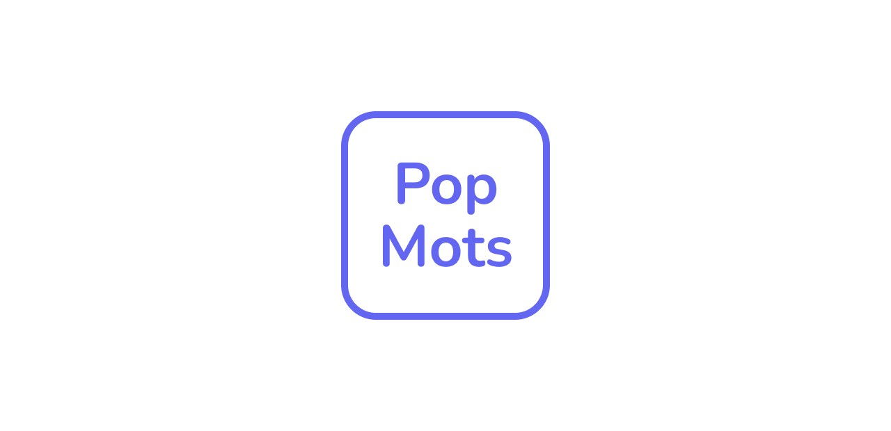

# PopMots!

## Introduction

Popmots is a responsive progressive web app that allows you to learn the 10000 most common French words with flashcards using spaced repetition.

You can study flashcards for each word. Each flashcard contain multiple meaning for the word along with examples and pronunctiation.

Data is stored locally, so no need of log in but if you want to use the app on a different device, you need to export your data and import it into the app on the other device.

Try it out at [https://popmots.com](https://popmots.com) !

## Features

- [x] Words from [my dictionary generator](https://github.com/claudiabdm/french-most-common-words-dictionary-generator) that uses [lexique](http://www.lexique.org/) and [kaikki](https://kaikki.org/) databases.
- [x] Schedule cards based on the [fsrs](https://github.com/open-spaced-repetition/free-spaced-repetition-scheduler) spaced repetition algorithm
- [x] Rate flashcards by hard, good or easy to remember
- [x] 7 day forecast of due cards
- [x] Set the number of new cards per day
- [x] PWA and responsive design make it possible to install it in any device
- [x] ~10000 most common words
- [x] Connected to dictionary API (Using Cloudflare functions and D1 database)
- [x] Local audio
- [x] Download/Upload popmots data.
- [x] No required login/signups
- [ ] Option to login/signup for using the same data in different devices
- [ ] Improve accessibility
- [ ] Offline

## Tech Stack

- [Sass](https://sass-lang.com/)
- [Vue 3](https://vuejs.org/)
- [TypeScript](https://www.typescriptlang.org/)
- [Chart.js](https://www.chartjs.org/)
- [Spaced Repetition Scheduler](https://github.com/open-spaced-repetition/ts-fsrs)
- [Cloudflare Pages](https://pages.cloudflare.com)
- [Cloudflare Functions](https://developers.cloudflare.com/pages/functions/)
- [Cloudflare D1 database](https://developers.cloudflare.com/d1/)
